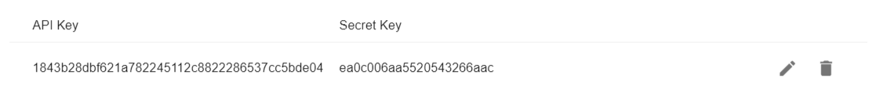

# 사전 준비 사항

아임웹 API는 아임웹에서 개설한 사용자 사이트의 키 정보를  기반으로 동작합니다. 따라서 아임웹API를 사용하려면  아임웹 사용자 사이트에서 API Key 와 Secret Key를 발급받아야 합니다.

아래와 같은 순서로 키를 발급 받으십시오.

해당 키는 사이트 단위로 생성되기 때문에 여러 사이트를 운영한다면 구분하여 사용하시기 바랍니다.

## 키 발급하기

1. 아직 [아임웹](https://imweb.me)에서 사이트를 개설하지 않으셨다면 사이트를 개설합니다.
2.  [내 사이트](https://imweb.me/mysite) > 에서 **관리** 버튼을 눌러 **사이트 관리페이지**로 이동합니다.\

    <figure><figcaption></figcaption></figure>
3. 환경설정 > **외부 서비스 연동 (API)**으로 이동합니다.\
   \

4.  **API key 발급받기** 버튼을 누릅니다.

    <figure><figcaption></figcaption></figure>
