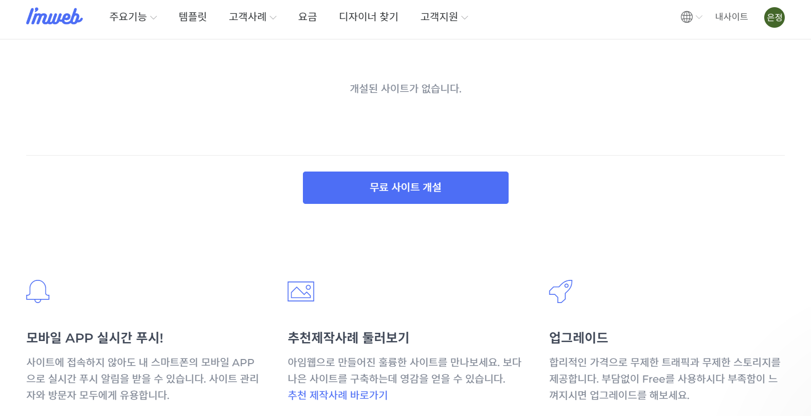

# Step 2: 키 발급받기

아임웹 API로 사용자 사이트의 정보에 접근하려면, 유효한 키 정보를 가지고 인증 절차를 거쳐야 합니다.

아래와 같은 순서로 키 정보에 해당하는 **API Key**와 **Secret Key**를  발급받습니다.

1. 아직 [아임웹](https://imweb.me)에서 사이트를 개설하지 않으셨다면 사이트를 개설합니다.
2.  아임웸에서 개설한 [내사이트](https://imweb.me/mysite)에서 **관리**를 클릭하여 관리자(admin) 페이지로 이동합니다.

    <figure><figcaption></figcaption></figure>
3. 관리자 페이지에서 **환경설정 > 외부 서비스 연동 (API)**으로 이동합니다.\
   \

4.  **API key 발급받기**를 클릭하면 아래와 같은 **API Key**와 **Secret Key**가 생성된 것을 확인할 수 있습니다.\

    <figure><figcaption></figcaption></figure>

